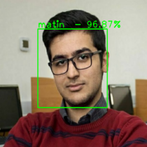
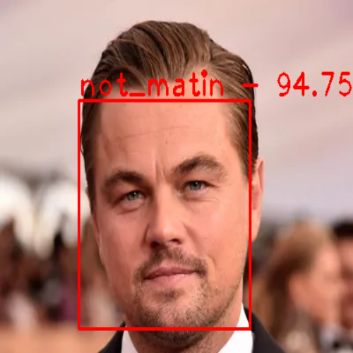

# Face Detection with small MobileNet, Tensorflow.
Trained a face classification with two labels --> Matin or Not Matin.

 

## Architecture:
- The model has two parts a face localization and a face classification.

- For classification the top layer of mobilenet has been removed and used a global average pooling 2D and a linear layer instead for classification purpose.

For localization used open-cv cascade classifier.

## Train the model:
For training the model:

- provide a dataset with two kinds of images. in this case the dataset is the images of me and the images which are not me.

- create a python environment and install requirements ```pip install requirements.txt```.

- customize the configuration file with file directories and batch size and etc.

- it is possible to augment your data by running ```data_augmentation.py```.

- train your model by running the ```face_classification.py```.

- for real-time face detection run ```face_detection.py```.


